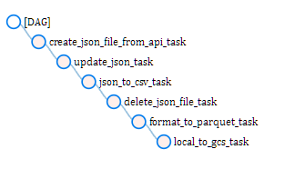
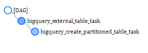

# UK crime data

UK Police Data Ingestion  

The aim of the project is to ingest data from uk police data API to Gcloud - BigQuery.  
To be more precise, data is coming from this API about stop and searches by force:  
https://data.police.uk/docs/method/stops-force/  
  
We will investigate data from 'metropolitan' police force.  

## Project Architecture

These Technologies are used for this Project:   
* Python
* Docker Compose
* Airflow
* Gcloud Storage
* Gcloud BigQuery
* Gcloud Data Studio
* Terraform

## Dags
As a description of the Pipeline, the DAGS tasks are presented here:  
   

   

## Setup Google Cloud project  

Setup your account as described [here](/Initial-setup.md)  

## Update Files   

Update the terraform [`variables.tf`](/terraform/variables.tf) 
```
variable "project" {
  description = "Your GCP Project ID"
}
```

Update the [`docker-compose.yaml`](/airflow/docker-compose.yaml) file with your project id and google storage bucket   
```
GCP_PROJECT_ID: 'de-bootcamp-339509'
GCP_GCS_BUCKET: 'dtc_data_lake_de-bootcamp-339509'
```

```
echo -e "AIRFLOW_UID=$(id -u)\nAIRFLOW_GID=0" > .env
docker-compose up airflow-init
docker-compose up
```

## Terraform
```
gcloud auth application-default login 
```
```
terraform init
terraform plan
terraform apply
```
## Queries  

 
<!-- ```
make run-code
```
```
make run-tests
``` -->
