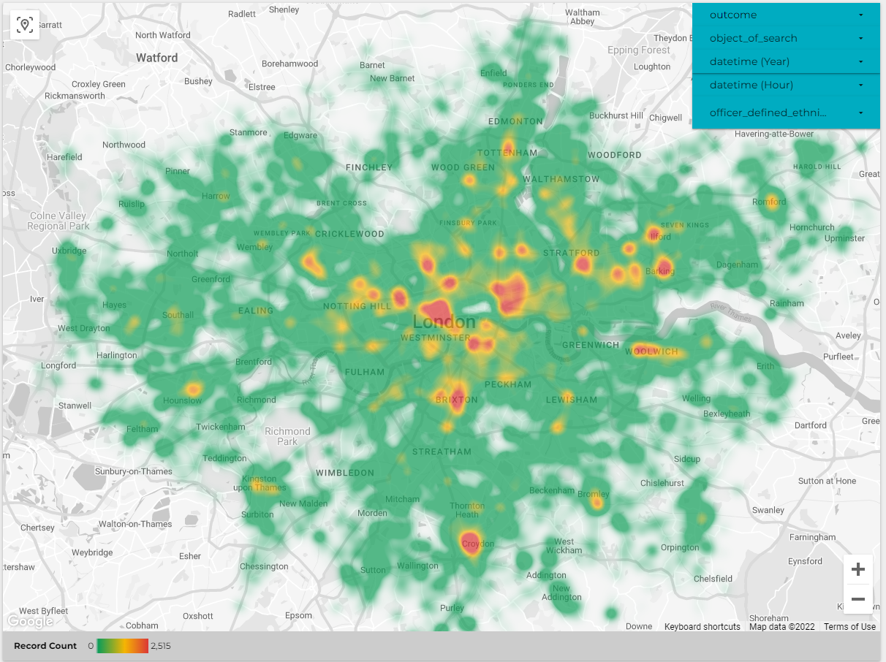

# UK crime data

UK Police Data Ingestion  

The aim of the project is to ingest data from UK police data API to Google cloud Storage -> BigQuery -> Data studio.  
To be more precise, data is coming from this API about stop and searches by force:  
https://data.police.uk/docs/method/stops-force/  
  
The data from 'metropolitan' police force is used.  

## Project Architecture

These Technologies are used for this Project:   
* Python
* Docker Compose
* Airflow
* Google cloud Storage
* Google cloud BigQuery
* Google cloud Data Studio
* Terraform
* PySpark
* Jupyter Notebooks

## Dags
As a description of the Pipeline, the DAGS tasks are presented here:  
   

<br/><br/>   


   
## Setup Google Cloud project  

Setup your account as described [here](/Initial-setup.md)  

## Update Files   

Update the terraform [`variables.tf`](/terraform/variables.tf) 
```
variable "project" {
  description = "Your GCP Project ID"
}
```

Update the [`docker-compose.yaml`](/airflow/docker-compose.yaml) file with your project id and google storage bucket   
```
GCP_PROJECT_ID: 'de-bootcamp-339509'
GCP_GCS_BUCKET: 'dtc_data_lake_de-bootcamp-339509'
```

```
echo -e "AIRFLOW_UID=$(id -u)\nAIRFLOW_GID=0" > .env
docker-compose up airflow-init
docker-compose up
```

## Terraform
```
gcloud auth application-default login 
```
```
terraform init
terraform plan
terraform apply
```

## Airflow

There are two DAGS in airflow   
The `data_ingestion` dag is running monthly to collect the data   
The `gcs_to_bq_dag` is running once, when the DAG has finished

## Big Query

A partioned table is created in Big Query.  
The partition is based on `datetime` to optimise performance when querying based on `datetime`   

## Queries  

This is the Query needed to produce the dashboard   

```
SELECT
IFNULL(NULLIF(age_range,''),'N/A') AS age_range,
IFNULL(NULLIF(outcome,''),'N/A') AS outcome,
IFNULL(NULLIF(gender,''),'N/A') AS gender,
datetime,
IFNULL(NULLIF(officer_defined_ethnicity,''),'N/A') AS officer_defined_ethnicity,
IFNULL(NULLIF(type,''),'N/A') AS type,
IFNULL(NULLIF(object_of_search,''),'N/A') AS object_of_search,
latitude,
longitude,
lat_long
FROM 'de-bootcamp-339509.stop_and_search.stop_and_search_partitioned_table'
```
More queries are in this file [queries.sql](queries.sql)

# Dashboard

Link to Data Studio [`report`](https://datastudio.google.com/reporting/a5549182-d121-4db6-8955-17de26c95602)   

<br/><br/>   


# Notebooks   

## PySpark Jupyter Notebooks Analysis   
An analysis of sample data is presented in this jupyter notebook file [search-force.ipynb](/notebooks/search-force.ipynb)   

## Read from Google cloud Storage with Spark and Jupyter
[gcs-search-force.ipynb](/notebooks/gcs-search-force.ipynb)

